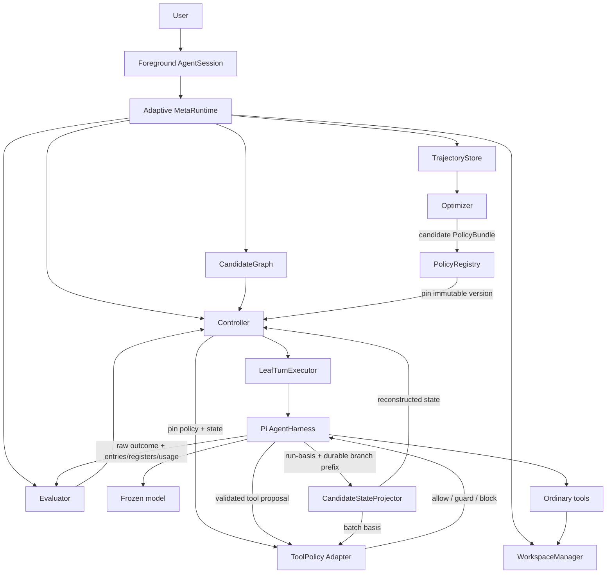

# Adaptive MetaRuntime on Pi

Status: Architecture proposal; Stage 0, migration batch M0, Stage 1 Slice 1-2, Stage 2 R1-R2, Stage 3 R3-R4, Stage 4 R5/R6/S1, Stage 5 single-candidate adaptive tool loop, Stage 6 exact continuation admission, Stage 7 Windows/Git WorkspaceManager have been implemented and passed acceptance; Stage 8 Minimal Adaptive Runtime has been completed (including S8 promotion-lineage acceptance, with derived snapshots separating forkBase and promotionOrigin baselines); not yet entering Stage 9 (R7 deferred polling, compaction, and navigation remain deferred).

Last updated: 2026-08-14

This document only solidifies the **long-term architecture and Module contracts** of the Adaptive MetaRuntime based on Pi and Harness v4. Non-violable runtime semantics are moved to [`INVARIANTS.md`](./INVARIANTS.md); implementation progress and milestone acceptance records are moved to [`IMPLEMENTATION_STATUS.md`](./IMPLEMENTATION_STATUS.md); the testing/recovery matrix is moved to [`CONFORMANCE.md`](./CONFORMANCE.md); frozen and pending decisions are moved to [`DECISIONS.md`](./DECISIONS.md) and [`ADR/`](./ADR/); the specific implementation contract for the Windows/Git WorkspaceManager continues to be governed by `packages/adaptive-agent/docs/workspace-manager.md`.

The Harness v4 baseline is fixed to the `packages/agent/docs/harness.md` at upstream commit `9795d6023`. Subsequent upstream changes must be subject to explicit migration review and must not silently change the operation, entry, register, usage, resume, and fork semantics that this document depends on.

## 1. Conclusions and boundaries

Do not rewrite Pi, and do not make Controller, Evaluator, or Optimizer into model-visible tools.

Responsibilities compressed into one sentence: the frozen model is responsible for proposing "how to do it"; the Controller decides "whether to allow it and how to use Pi next"; the Evaluator judges "how well that just went"; the Optimizer only summarizes and publishes better rules for future Tasks.

```text
Foreground Session
        │
        ▼
Adaptive MetaRuntime
  ├─ CandidateGraph
  ├─ CandidateStateProjector
  ├─ Controller
  │   ├─ TurnPolicy
  │   └─ ExecutionPolicy
  │       └─ ToolPolicy
  ├─ Evaluator
  ├─ WorkspaceManager
  ├─ PolicyRegistry
  ├─ TrajectoryStore
  └─ Optimizer
        │
        ▼
LeafTurnExecutor
        │
        ▼
Pi AgentHarness + frozen model + ordinary tools
```

Core boundaries:

1. Pi produces stochastic trajectories of the same frozen model; the Adaptive MetaRuntime organizes, evaluates, branches, prunes, and selects trajectories.
2. `LeafTurnExecutor` adds at most one new assistant response at a time and completes its full tool batch before returning; a durable Run still continues from operation acceptance to the terminal transaction.
3. A candidate has both conversation state and workspace state; the two must be forked, restored, and retired in pairs.
4. Controller/Evaluator meta-actions are model-invisible by default; only explicit non-exact actions are allowed to change model input.
5. `BRANCH` uses exact continuation; it keeps model-visible premises equivalent, but accepts a new durable continuation Run for each child and does not copy the source `op.*` open-operation state.
6. The current Task pins an immutable `PolicyBundleRef`; the Optimizer only publishes new versions that affect future Tasks.
7. Provider-visible tools are fixed to `read`, `write`, `edit`, `bash` under the current fixed-tool profile, including name, schema, description, and order.
8. ToolPolicy only allows `allow`, `block`, and semantics-preserving `argument_guard`; it does not generate new coding tool calls or perform result shaping.
9. The authority of execution history is in the Harness; the authority of policy content is in PolicyRegistry; CandidatePolicyState is a deterministic projection; TrajectoryStore is non-authoritative research data.
10. Storage/invariant faults must not be disguised as ordinary tool failures; policy faults that need to be blocked before effect are always fail-closed.

Model parameters always satisfy:

```text
theta_model(next) = theta_model(current)
```

Full normative constraints are in [`INVARIANTS.md`](./INVARIANTS.md).

## 2. Current Pi and target call chain

Current main call chain:

```text
cli.ts
  -> main.ts
  -> InteractiveMode.run()
  -> AgentSession.prompt()
  -> Agent.prompt()
  -> agent-loop
  -> ModelRuntime
  -> Provider
  -> remote model
```

Target call chain:



The coding-agent's UI, provider selection, authentication, ordinary tools, session presentation, and final result presentation are preserved as much as possible. The main changes occur in execution orchestration.

## 3. Architecture language and Module map

- **Module**: A code unit with an Interface and Implementation.
- **Interface**: The types, constraints, ordering, errors, and performance characteristics that a caller must know to correctly use a Module.
- **Implementation**: The concrete code behind the Interface.
- **Seam**: A location where behavior can be replaced without modifying the caller in place.
- **Adapter**: A concrete implementation that satisfies an Interface at a Seam.
- **Depth**: The Leverage produced by a small Interface hiding a large amount of behavior.
- **Leverage**: The capability a caller gains from a deep Module.
- **Locality**: Changes, errors, knowledge, and validation concentrated in one location.

| Module | Interface responsibilities | Implementation hidden details |
|---|---|---|
| `LeafTurnExecutor` | Execute/advance a candidate to the next post-turn yield | Harness drive, durable query, cursor guard, result normalization |
| `BranchContinuation` | Create context-exact siblings from a branchable checkpoint | session/workspace fork, continuation admission, fingerprint, journal/recovery |
| `CandidateGraph` | Manage candidate relationships, state, value, and lifecycle | Node indexing, parent-child relationships, pruning, terminal fold |
| `CandidateStateProjector` | Reconstruct the policy state at a given cursor from a durable basis | deterministic projection, batch-start view, fingerprint, cache |
| `WorkspaceManager` | capture/fork/snapshot/diff/promote/release/recover | Git worktree, Windows paths, manifest, promotion/recovery |
| `ExecutionEnvironment` | Provide stable logical workspace identity to the model/tools | physical cwd/path projection, environment fingerprint |
| `Evaluator` | Fuse environment and trajectory evidence into a `BeliefState` | hard verifier, deterministic rules, learned evidence, evidence fusion, calibration, durable evaluator adapter |
| `Controller` | Select execution strategy at post-turn and tool-clearance Seams | TurnPolicy, ToolPolicy, Verification/Termination policy, meta search |
| `PolicyRegistry` | Publish/resolve immutable `PolicyBundleRef` | canonical serialization, fingerprint, lineage, promotion/retention |
| `TrajectoryStore` | Store research records including failed/pruned branches | schema, redaction, indexing, retention |
| `Optimizer` | Produce policy candidates usable by future Tasks | calibration, offline learning, promotion gate |

These Modules should remain deep; the Adaptive MetaRuntime does not learn Git worktree command sequences, nor does it learn the recovery details of Harness register hydration and terminal cleanup.

## 4. Task, Run, Turn, and Candidate

```text
Task
  ├─ Candidate A -> Run A1 -> Turn -> Step/tool effects
  ├─ Candidate B -> Run B1 -> Turn -> Step/tool effects
  └─ Candidate C -> Run C1 -> Turn -> Step/tool effects
```

- **Task**: A top-level user goal and all candidates created for it; it is the lifecycle of adaptation.
- **Candidate**: An independently evolving conversation/workspace/control state.
- **Run**: A durable operation from when the Harness atomically accepts a prompt or exact-continuation intent to the terminal transaction.
- **Turn**: One assistant step plus the complete tool batch requested by that assistant message.
- **Step**: A retryable unit of work within the Harness; a tool call is a kind of step, but a step is not limited to tool calls.

`PolicyBundle` is a canonical, immutable artifact that binds at least Controller/ToolPolicy rules, deterministic Evaluator rules, evidence fusion version/config, an online learned evaluator profile/reference, `CandidateStateProjector` version, and related schema versions. It references immutable evaluator artifact/profile identity; it does not embed learned evaluator model weights directly:

```ts
interface PolicyBundleRef {
  version: string;
  fingerprint: string;
}
```

Task admission and Run restore must re-resolve and validate the same artifact; missing, fingerprint mismatch, or unsupported schema all fail-closed.

Candidate state does not establish a second correctness-critical mutable Store:

```text
CandidatePolicyState(candidate, cursor)
  = CandidateStateProjector(
      pinned PolicyBundleRef,
      inherited capsule from adaptive.run_basis,
      durable entry branch + usage through cursor,
      reconstructible workspace metadata
    )
```

```ts
interface ProjectionBasis {
  taskId: string;
  candidateId: string;
  sessionId: string;
  lane: string;
  operationId: string;
  cursor:
    | { kind: "task_origin" }
    | { kind: "post_turn"; cursor: LeafTurnCursor }
    | { kind: "tool_batch_start"; assistantEntryId: string };
  policyBundle: PolicyBundleRef;
  projectorVersion: string;
  inheritedStateFingerprint: string;
}

interface CandidatePolicyStateRef {
  basis: ProjectionBasis;
  fingerprint: string;
}
```

The "state update" after a step/turn means re-projecting after the durable prefix is extended, not writing mutable counters to another authoritative database. The cache can be deleted and recomputed; when the same basis yields a different fingerprint, further effect/branch must stop.

## 5. LeafTurn and Harness v4

### 5.1 Semantic boundary

Do not add `AgentHarness.runTurn()`, and do not treat a turn as a completed durable Run:

```text
run acceptance TX
  -> adaptive.run_basis + optional prompt entries
  -> op.meta + total op.state + lane state
  -> assistant step
  -> complete tool batch
  -> process-local turn_end
  -> post-turn yield          # Run may remain open
  -> Controller decision
  -> resume
  -> next turn / settle
  -> terminal TX
```

`LeafTurn` is an observable slice on an open Run.

### 5.2 Stable Interface

```ts
type LeafTurnCommand =
  | { kind: "start"; prompt: AgentMessage | AgentMessage[] }
  | { kind: "advance"; afterCursor?: LeafTurnCursor };

interface LeafTurnCursor {
  operationId: string;
  assistantEntryId: string;
  leafId: string;
}

interface LeafTurnResult {
  operationId: string;
  cursor: LeafTurnCursor;
  beforeLeafId: string | null;
  afterLeafId: string;
  assistantEntryId: string;
  toolResultEntryIds: string[];
  usageRowIds: string[];
  message: AssistantMessage;
  toolResults: ToolResultMessage[];
  usage: Usage;
}

interface LeafTurnExecutor {
  execute(command: LeafTurnCommand):
    Promise<LeafTurnExecutionResult<LeafTurnOutcome, LeafTurnRejected>>;
  abort():
    Promise<LeafTurnExecutionResult<LeafTurnAbortOutcome, LeafTurnAbortRejected>>;
}
```

`start` is only for idle candidates; `advance` is for open/suspended candidates; `afterCursor` is an optimistic concurrency guard; concurrent drive returns `DriverBusy`. Recovery identity uses the durable `LeafTurnCursor`, not the process-local `turnId`.

`LegacyAgentLeafAdapter` is only for sharing single-turn semantic characterization; `HarnessV4LeafTurnAdapter` is the durable production Adapter. Manual drive is for deterministic crash tests; the production path drives to post-turn/settled/suspended yield through a process-local semantic driver and does not make yield a durable effect.

## 6. Exact continuation and BranchContinuation

Harness session fork can copy the immutable entry prefix but cannot copy the source open Run's `op.*` registers, queues, or process-local drive. Therefore, exact branch uses "entries-only fork + new continuation Run":

```text
source open Run reaches branchable checkpoint
  -> freeze committed conversation + workspace + execution snapshot
  -> fork entries-only child sessions
  -> each child accepts a new durable continuation Run
  -> append model-invisible adaptive.run_basis
  -> verify canonical request fingerprint
  -> dispatch first request with sampling-envelope differences only
```

The meaning of exact is **model-context exact**: same committed leaf + equivalent canonical inference request + new child Run. It does not mean open-operation-state cloning.

### 6.1 Exactness envelope

Exact siblings must share: conversation path/leaf, workspace snapshot/fingerprint, provider/model, thinking level, system prompt, provider messages, tool schemas/order, stream options not in the sampling allowlist, hook/extension version, context projection/compaction state, logical workspace identity, projector/state fingerprint, and fixed tool catalog fingerprint.

Allowed differences: child/session/operation identity, entry/register sequence/timestamp, transport/auth identity, explicit sampling seed (if supported), and provider internal randomness.

The physical worktree path must not become a model-visible exactness difference; `ExecutionEnvironment` maps it to a stable logical workspace root. temperature/top-p/tool availability/system prompt/strategy instructions must not be changed through exact `BRANCH` by default; such differences belong to `DIVERSIFY`.

### 6.2 Branchable checkpoint

A post-turn checkpoint can only exact branch when the following conditions are met:

- assistant, complete tool-result batch, and usage are durable; cursor is consistent with the lane leaf;
- the next semantic action is indeed an assistant continuation;
- no unresolved effects, deferred handles, retry/backoff, or abort reconciliation;
- pending writes/steering/follow-up/required compaction have been deterministically handled;
- model/tool/hook/resource identity is recoverable;
- conversation and immutable workspace snapshot are captured in pairs under the same source driver lease;
- `CandidateStateProjector` has successfully reconstructed the state fingerprint;
- execution profile is exact-compatible.

An ordinary settled final answer is not a branchable continuation source. After `BRANCH(k)`, the source candidate is frozen, and all active siblings go through the same continuation admission path from the same snapshot.

### 6.3 BranchContinuation Interface

```ts
interface CandidatePolicyStateCapsule extends CandidatePolicyStateRef {
  snapshot: CandidatePolicyStateSnapshot;
}

interface ContinuationCheckpoint {
  sourceSessionId: string;
  sourceLane: string;
  cursor: LeafTurnCursor;
  workspaceSnapshotId: string;
  contextFingerprint: string;
  requestFingerprint: string;
  policyState: CandidatePolicyStateCapsule;
  fixedToolCatalogFingerprint: string;
}

interface ExactSamplingVariant {
  id: string;
  seed?: number;
}

interface BranchContinuation {
  forkExact(
    source: ContinuationCheckpoint,
    variants: ExactSamplingVariant[],
  ): Promise<Result<ContinuationCandidate[], ContinuationRejected>>;
}
```

`ContinuationCandidate` identity is determined by the continuation group, source cursor, and sample index. Session fork, workspace fork, and child Run acceptance span multiple durable stores, so the Implementation uses an append-only `ContinuationJournal`:

```text
group_planned
  -> child_session_forked
  -> child_workspace_ready
  -> child_run_accepted
  -> child_ready
```

Crash recovery must reattach existing objects and must not create twin sessions/workspaces/runs; half-created children that cannot complete are marked failed and safely released.

### 6.4 Adaptive run admission

Adaptive Run acceptance must atomically commit `adaptive.run_basis`, optional prompt entries, `op.meta`, initial total `op.state`, and lane state. `adaptive.run_basis` is a model-invisible, post-terminal-retained policy/provenance payload; `op.meta` only references it.

Prompt starts must have a prompt entry; exact continuation has an empty prompt list, with the basis entry serving as the trigger, and the interpreter directly enters assistant generation. Before dispatch, the normalized request fingerprint is recalculated; differences outside the sampling allowlist return `RequestFingerprintMismatch` and must not send the request.

## 7. Tool Control Seam

The Controller has two cadences:

```text
post-turn checkpoint
  -> TurnPolicy
  -> MetaAction

validated model-proposed tool call
  -> ToolPolicy
  -> allow / argument_guard / block
```

ToolPolicy is a guardrail branch of the Controller Implementation; it is not a planner, nor is it a provider-visible tool. The model still decides which tools to call and the original arguments.

```text
assistant tool call committed
  -> schema validation
  -> reconstruct batch-start policy basis
  -> source-ordered ToolPolicy clearance for whole batch
  -> validate effective arguments
  -> append adaptive.tool_batch
  -> allowed effects
  -> source-ordered tool-result entries
  -> StepEvaluator evidence
  -> next projection
```

```ts
type ToolPolicyDecision =
  | { kind: "allow"; reasonCodes: string[] }
  | {
      kind: "argument_guard";
      effectiveArgs: Record<string, unknown>;
      reasonCodes: string[];
    }
  | { kind: "block"; reason: string; reasonCodes: string[] };

interface AdaptiveToolBatchData {
  schemaVersion: 1;
  policyStateFingerprint: string;
  decisions: DurableToolDecision[];
}
```

All clearances for a batch use the same `tool_batch_start` projection. `argument_guard` can only perform semantics-preserving transformations and must re-pass schema validation; material rewrite, defer, reorder, and result shaping are not part of the MVP. A crash before `adaptive.tool_batch` commit can re-clear from the same pinned basis; after commit, only the persisted decisions/effective args are read.

Tool replay is still governed by the Harness's replay declaration: both captured/current must be `safe` to re-execute unknown-effect tools; otherwise, a synthetic `interrupted` is written. ToolPolicy does not self-retry side-effecting tools.

## 8. CandidateGraph and Controller

```ts
interface CandidateNode {
  id: string;
  parentId?: string;
  conversation: {
    sessionId: string;
    lane: string;
    leafId: string;
    operationId?: string;
    cursor?: LeafTurnCursor;
  };
  workspace: {
    snapshotId: string;
    leaseId?: string;
    root?: string;
  };
  control: {
    taskPhase: "explore" | "implement" | "recover" | "verify";
    policyState: CandidatePolicyStateRef;
    verificationDebt: number;
  };
  belief: BeliefState;
  cost: ComputeCost;
  depth: number;
  strategy: StrategyDescriptor;
  status: "active" | "pruned" | "failed" | "verified" | "terminal";
}
```

The initial version uses one hidden Harness session and one workspace lease per active candidate. CandidateNode only holds `CandidatePolicyStateRef` and small projections needed for scheduling; the full state is reconstructed by the Projector from the durable basis.

The full MetaAction vocabulary is `continue`, exact `branch`, `backtrack`, `verify`, `retrieve`, `replan`, `diversify`, `compact`, `prune`, `merge_knowledge`, `restart`, `stop`. The minimal runtime in the current Stage 8 only implements the frozen scope; actions not yet in implementation must not be treated as available functionality just because the type exists.

`BRANCH` and `DIVERSIFY` must be separated: the former keeps request premises exact, while the latter allows changing hypothesis/context/strategy/sampling configuration. The two types of trajectories must not be mixed as exact sampling data.

CandidatePolicyState projects at least: file/context freshness, recent action signatures, failure fingerprints, tool error/latency statistics, workspace-change summary, verification evidence/debt, and model capability posterior. It does not store Controller weights.

The Controller does not generate code, nor does it assume task planning for the frozen model:

```text
Pi turn/tool evidence
+ workspace diff/test evidence
+ BeliefState
+ CandidateGraph
+ ModelProfile
+ compute budget
    -> TurnPolicy -> MetaAction

validated tool proposal
+ CandidatePolicyState
+ pinned PolicyBundle
    -> ToolPolicy -> allow / guard / block
```

The Controller's target form may include Meta Policy, Meta World Model, Meta Value, and meta-level search, but the search target is always "how to use Pi next." The first phase does not add a Planner Module, provider-visible tool, or subagent, and does not let the Controller auto-generate coding tool calls.

Stopping conditions consider at least:

```text
P(success) > success threshold
evidenceCoverage > evidence threshold
expected value of more compute <= 0
```

## 9. Workspace isolation and winner promotion

CandidateGraph branching is only real when the workspace is equally isolated. The stable Interface of `WorkspaceManager`:

```ts
interface WorkspaceManager {
  capture(sourceRoot: string, policy: WorkspacePolicy): Promise<WorkspaceSnapshotRef>;
  fork(snapshot: WorkspaceSnapshotRef, candidateId: string): Promise<WorkspaceLease>;
  snapshot(lease: WorkspaceLease): Promise<WorkspaceSnapshotRef>;
  diff(lease: WorkspaceLease): Promise<WorkspacePatch>;
  promote(
    lease: WorkspaceLease,
    expectedForegroundFingerprint: string,
  ): Promise<PromotionResult>;
  release(lease: WorkspaceLease): Promise<void>;
  recover(): Promise<WorkspaceRecoveryReport>;
}
```

The initial production Adapter is the Windows/Git `GitWorktreeWorkspaceAdapter`; the test Adapter uses real byte copy, not hardlink. Core semantics:

- foreground capture does not modify user branch/index/files; tracked + untracked non-ignored state enters the snapshot; ignored/secrets/large caches are excluded by default;
- candidate worktree/lease is located in a manager-owned root; the model only sees a stable logical cwd;
- candidate diff covers committed/staged/unstaged tracked changes and untracked create/modify/delete;
- promotion first runs the winner workspace verifier, then re-checks the foreground fingerprint; on drift, zero writes;
- promotion only applies working-tree diff, does not commit, does not stage; multi-file writes are supported by `PromotionJournal` for crash recovery;
- on final verifier failure, only touched paths not modified again by the user are allowed automatic recovery; otherwise returns `PromotionNeedsAttention`;
- no automatic three-way merge; Git worktree is file-state isolation, not process/network security sandbox.

The specific Git/Windows object/ref/worktree, path/reparse-point, content store, promotion journal, and recovery contracts are maintained in `packages/adaptive-agent/docs/workspace-manager.md`; the main design does not repeat its Implementation.

## 10. Evaluator

The Evaluator is not a model tool; it does not serialize control/evidence into provider-visible input. It is layered by cadence:

```text
StepEvaluator
  -> tool success/error
  -> information gain
  -> redundancy/risk/cost
  -> workspace delta

TurnEvaluator
  -> progress delta
  -> compiler/test delta
  -> repeated failure pattern
  -> task phase / verification debt

TaskEvaluator
  -> requirement coverage
  -> final verification
  -> regression evidence
  -> terminal ground truth
```

The Evaluator's evidence model is layered by source and fused into a `BeliefState`:

```text
HardVerifierEvidence
DeterministicEvaluatorEvidence
LearnedEvaluatorEvidence
        ↓
EvidenceFusion (versioned, pinned by PolicyBundle)
        ↓
BeliefState
```

- `HardVerifierEvidence` comes from the Hard Verifier, the highest-confidence executable evidence source.
- `DeterministicEvaluatorEvidence` comes from calibrated deterministic rules reconstructed from durable facts, and is therefore replayable.
- `LearnedEvaluatorEvidence` comes from the Stage 9 `LearnedEvaluator`.

A judge that does not satisfy the D20 online authority contract can only enter TrajectoryStore. A learned evaluator whose evidence satisfies D20 can affect the current Task after durable settlement; before that settlement, its output is not Controller-visible.

```ts
interface BeliefState {
  successProbability: Distribution;
  currentPathValue: Distribution;
  requirementStatus: Record<string, PredicateBelief>;
  failurePosterior: Record<FailureMode, number>;
  uncertainty: number;
  progressRate: number;
  evidenceCoverage: number;
  candidateNovelty: number;
  requestedEvidence: EvidenceRequest[];
}
```

Hard Verifiers directly run tests/compiler/lint/type checker/diff inspection etc. in the candidate workspace, without going through the frozen model. The Evaluator outputs evidence/belief with sources and uncertainty; it does not pass off a single correlation as a causal conclusion.

The MVP does not perform result shaping: raw tool outcomes only go through Harness standard error conversion/normalization; durable and model-visible results are semantically equivalent. Raw-only evidence can only affect the CandidatePolicyState after recovery if it is persisted as an explicit authority.

## 11. Authority, trajectory, and policy lifecycle

| Module / artifact | Authority | What it drives |
|---|---|---|
| Harness current registers | open-operation authority | resume, effect recovery, abort reconciliation |
| Harness immutable entries + usage | completed-history authority | state reconstruction, branch/fork, budget |
| PolicyRegistry | immutable policy authority | resolve pinned policy, provide future active version |
| CandidateStateProjector | deterministic derived view | ToolPolicy/TurnPolicy/branch admission |
| EvaluatorEvidence | durable evaluator evidence authority | evidence fusion → BeliefState → Controller |
| projection cache | non-authoritative, disposable | performance |
| TrajectoryStore | non-authoritative research data | observability, analysis, Optimizer training |

```text
adaptive.run_basis + durable entry branch + usage
  + PolicyRegistry.resolve(pinned PolicyBundle)
  + pinned projector version
  + reconstructible workspace metadata
  -> CandidateStateProjector
  -> CandidatePolicyState + fingerprint
```

TrajectoryStore uses stable identities to link task/candidate/session/operation/assistant/tool/result/policy version, storing model fingerprints, task features, hidden branches, meta-actions, belief/state, tool decisions, redacted outcome/workspace evidence, pruned/failed branches, terminal ground truth, and compute cost. It allows at-least-once delivery and deduplication; loss cannot change execution correctness.

The system has two time scales:

```text
Fast loop
  frozen model
    -> tool / Harness durable result
    -> deterministic evaluator
    -> optional learned evaluator invocation
    -> durable evaluator evidence
    -> evidence fusion
    -> BeliefState / CandidatePolicyState
    -> Controller

Slow loop
  trajectories
    -> evaluator aggregation / calibration
    -> Optimizer
    -> candidate PolicyBundle
    -> offline evaluation / promotion
    -> automatic promotion
    -> rollback / reference switching
    -> dataset / provenance
    -> future Task admission
```

PolicyRegistry publication semantics: the same version always corresponds to the same canonical content/fingerprint; published versions are immutable and old versions are retained; versions referenced by Tasks/recoverable Runs must not be updated or deleted in place; new candidates published by the Optimizer must carry parent/optimizer/dataset/evaluation provenance and a canonical content fingerprint; only after passing the offline evaluation/promotion gate can a candidate be automatically promoted for new Task admission. Promotion switches the future-active reference; rollback switches that reference back to a prior version without modifying any historical PolicyBundle; already-admitted Tasks keep their pinned PolicyBundle.

The Optimizer does not enter the fast path of read/write/edit/bash, nor does it call another LLM for every tool call. The planned three-layer responsibilities:

1. Evaluator calibration: calibrate success posterior, failure classifier, and uncertainty using terminal ground truth.
2. Controller optimization: use CandidateGraph trajectory data to optimize policy/value/world model.
3. Harness architecture optimization: study action space, branch/context/verification/compaction strategy later.

Runtime profile resolution:

```text
global profile
  -> model profile
  -> task profile
  -> immutable PolicyBundle
  -> evolving per-candidate policy state
```

The last layer is evidence-driven state, not in-session weight hot updates.

## 12. Foreground / hidden worker presentation

```text
Foreground Session
    -> AdaptiveRuntime
       -> hidden worker B1 + workspace W1
       -> hidden worker B2 + workspace W2
       -> hidden verifier
       -> hidden worker B3 + workspace W3
    -> choose winner
    -> strict promote to foreground
    -> final verification
    -> ordinary Pi final response
```

Hidden sessions do not connect to the TUI. Only the winner diff, final verification evidence, and the final answer enter foreground presentation.

Foreground drift, promotion conflict, budget exhaustion, sandbox violation, or inability to verify must be returned as explicit states; they must not silently overwrite files or falsely report success.


## Appendix A. Stable persistence / admission schemas

The following types are cross-Module, crash/replay, or exact-continuation correctness contracts that need to be known, so they are retained after the simplification; Implementation-only journal/storage details remain in the corresponding Module documents.

### A.1 Adaptive Run basis

```ts
interface AdaptiveRunBasisData {
  schemaVersion: 1;
  operationId: string;
  taskId: string;
  candidateId: string;
  policyBundle: PolicyBundleRef;
  projectorVersion: string;
  inheritedPolicyState: CandidatePolicyStateCapsule;
  start:
    | { kind: "prompt" }
    | {
        kind: "exact_continuation";
        source: {
          parentSessionId: string;
          sourceCursor: LeafTurnCursor;
        };
        contextFingerprint: string;
        requestFingerprint: string;
        fixedToolCatalogFingerprint: string;
        sampling: ExactSamplingVariant;
      };
}

interface AdaptiveRunIntent {
  kind: "run";
  promptEntryIds: string[];
  adaptive: { basisEntryId: string };
  systemPromptOverride?: string;
  resumeData?: Record<string, JsonValue>;
}
```

Acceptance must append `adaptive.run_basis`, optional prompt messages, and write `op.meta`, initial total `op.state`, and lane registers in one transaction; any failure results in zero writes. The basis entry does not register a provider-context projector and is retained after terminal. Exact continuation does not append a hidden prompt; the normalized request fingerprint is recalculated before the first assistant request.

The stable rejection vocabulary for exact continuation includes at least:

```text
NotBranchableCheckpoint
SourceCheckpointChanged
WorkspaceSnapshotMismatch
MissingIdentities
NonDeterministicRequestPolicy
StateProjectionMismatch
RequestFingerprintMismatch
UnsupportedSamplingControl
```

`ContinuationJournal` or any related storage write failure is a Module fault; it is not degraded to an ordinary rejection; no partial sibling may dispatch before reconciliation completes.

### A.2 Tool batch durable decision

```ts
type DurableToolDecision =
  | {
      kind: "allow" | "argument_guard";
      sourceIndex: number;
      toolCallId: string;
      toolName: string;
      effectiveArgs: Record<string, JsonValue>;
      replay: "safe" | "never";
    }
  | {
      kind: "block";
      sourceIndex: number;
      toolCallId: string;
      toolName: string;
      reason: string;
    };

interface AdaptiveToolBatchData {
  schemaVersion: 1;
  policyStateFingerprint: string;
  decisions: DurableToolDecision[];
}

type ToolBatchPolicyBasis = CandidatePolicyStateRef & {
  basis: ProjectionBasis & {
    cursor: { kind: "tool_batch_start"; assistantEntryId: string };
  };
};
```

`adaptive.tool_batch` is the sole durable payload location for Adaptive effective arguments; Adaptive `op.state` only references it. All phase-1 clearances for a batch use the same batch-start fingerprint; earlier tool results do not change the clearance of subsequent calls. Decision telemetry, reason codes, features, and alternatives can be copied to TrajectoryStore but cannot replace the durable decision payload.

### A.3 Production drive seam

```ts
type DriveSelector =
  | { kind: "post_turn"; afterCursor?: LeafTurnCursor }
  | { kind: "settled" }
  | { kind: "suspended" };

interface ProcedureDriver {
  driveUntil(selector: DriveSelector): Promise<DriveYield>;
}
```

Semantic yield is a process-local control boundary; it does not write entries/registers and does not change the Harness durable state machine.

## 13. Document boundaries

- Normative invariants / durable authority / fault semantics: [`INVARIANTS.md`](./INVARIANTS.md)
- Implemented Stages, R/S tracks, current deferred scope: [`IMPLEMENTATION_STATUS.md`](./IMPLEMENTATION_STATUS.md)
- Semantic characterization, crash/replay, WorkspaceManager validation matrix: [`CONFORMANCE.md`](./CONFORMANCE.md)
- D1-D19 and ADRs: [`DECISIONS.md`](./DECISIONS.md), [`ADR/`](./ADR/)
- WorkspaceManager Git/Windows Implementation: `packages/adaptive-agent/docs/workspace-manager.md`

The main document only describes the stable architecture; implementation details, test checklists, and historical status are no longer repeated here.
